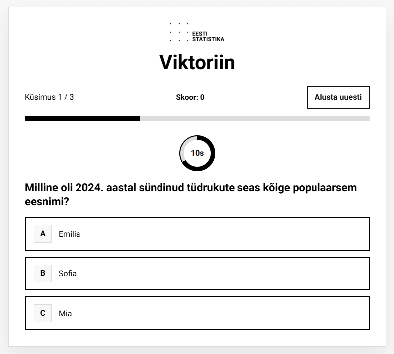

# 🧠 Statistikaameti viktoriin

Interaktiivne viktoriinirakendus, mis kontrollib kasutaja teadmisi valikvastustega küsimuste abil.  
Rakendus on ehitatud React + TypeScript + Vite stackiga ning sisaldab ka E2E teste Playwrightiga.

---

## 🚀 Demo

👉 [Ava rakendus](https://viktoriin-nu.vercel.app/)

---

## ✨ Funktsionaalsus

- Küsimused kuvatakse ükshaaval
- Igal küsimusel on mitu vastusevarianti
- Kohene tagasiside:
  - Õige vastus
  - Vale vastus
  - Aeg sai otsa
- Taimer igale küsimusele
- Edenemisriba (progress bar)
- Reaalajas skoor
- Lõpus:
  - lõppskoor
  - isikupärastatud sõnum
  - tulemuste tabel:
    - küsimus
    - kasutaja vastus
    - tulemus (õige / vale / vastamata)

---

## 🧪 Testimine

Rakendus sisaldab Playwright E2E teste:

- rakenduse avamine
- küsimusele vastamine
- skoori muutumine
- vale vastuse kontroll
- lõpptulemuse kuvamine

Testid jooksevad:
- Chromium
- Firefox
- WebKit

---

## 🛠️ Tehnoloogiad

- React
- TypeScript
- Vite
- Playwright (E2E testid)
- CSS (CVI-põhine disainisüsteem)

---

## 🎨 Disain

UI on loodud Statistikaameti CVI põhjal:

- Roboto font
- must-valge-hall värviskeem
- tagasiside värvid:
  - roheline (õige)
  - punane (vale)
  - kollane (vastamata / aeg sai otsa)
- selge tüpograafia ja visuaalne hierarhia

---

## 📁 Projekti struktuur
```bash
src/
assets/
logo_coat_of_arms.png
logo_png
taustata.png
components/
IntroCard.tsx
QuestionCard.tsx
QuizTopBar.tsx
ProgressBar.tsx
ScoreSummary.tsx
ResultsTable.tsx
data/
questions.ts
types/
QuizTypes.ts
App.css
App.tsx
index.css
main.tsx
```
---

## ⚙️ Käivitamine lokaalselt

```bash
npm install
npm run dev

Ava brauseris:
http://localhost:5173/

🧪 Testide käivitamine

npx playwright test
```

## 🔁 Edasised parendused (ideed)
mobiilivaate täiendav optimeerimine
animatsioonid ja micro-interactions
küsimuste API-st laadimine
tulemuste salvestamine (nt localStorage)
kasutaja taseme analüüs

---

## 👤 Autor
Anu Sirkas

---

## 📸 Screenshot

